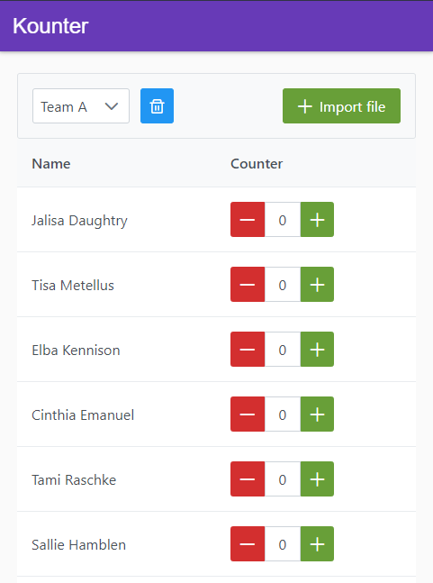

# Kounter

A small PWA to count many things in different lists.

Import a CSV file with your lists - it will be persisted in `localStorage` - and you'll be able to update the counters.

Technologies:

- [preact](https://preactjs.com/)
- [preact-cli](https://preactjs.com/cli)
- [pnpm](https://pnpm.js.org/)
- [sirv](https://github.com/lukeed/sirv)
- [PrimeReact](https://primefaces.org/primereact/showcase/#/)
- [CSS modules](https://github.com/css-modules/css-modules)
- GitHub Pages CI pipeline

## Example



A CSV file must be formatted like this:

| List name | Elements           |
| --------- | ------------------ |
| Team A    | Jalisa Daughtry    |
| &nbsp;    | Tisa Metellus      |
| &nbsp;    | Elba Kennison      |
| &nbsp;    | Cinthia Emanuel    |
| &nbsp;    | Tami Raschke       |
| &nbsp;    | Sallie Hamblen     |
| &nbsp;    | Jeni Carmona       |
| &nbsp;    | Natisha Peres      |
| &nbsp;    | Marcia Mongeau     |
| &nbsp;    | Concetta Heinrichs |
| &nbsp;    | Johnna Goetzinger  |
| &nbsp;    | Monet Caine        |
| Team B    | Blair Gomes        |
| &nbsp;    | Angeles Ratley     |
| &nbsp;    | Diana Garett       |
| &nbsp;    | Leatrice Winfree   |
| &nbsp;    | Gwenda Burciaga    |
| &nbsp;    | Tesha Tassone      |
| &nbsp;    | Lamonica Miner     |
| &nbsp;    | Elton Standley     |

As you can see, elements which are associated to an empty list name are considered to be in the last list.

The CSV file would be (separated with commas):

```csv
Team A,Jalisa Daughtry
,Tisa Metellus
,Elba Kennison
,Cinthia Emanuel
,Tami Raschke
,Sallie Hamblen
,Jeni Carmona
,Natisha Peres
,Marcia Mongeau
,Concetta Heinrichs
,Johnna Goetzinger
Team B,Monet Caine
,Blair Gomes
,Angeles Ratley
,Diana Garett
,Leatrice Winfree
,Gwenda Burciaga
,Tesha Tassone
,Lamonica Miner
,Elton Standley
```

## CLI Commands

The production build will only work in GitHub Pages.

```bash
# Install dependencies
npm install

# Serve with hot reload at localhost:8080
npm run dev

# Build for production with minification
npm run build

# Test the production build locally
npm run serve
```
